<!--
GitHub username is set to `kartikchhabra`.
Replace `kartikchhabra` everywhere only if your username changes.
For profile README, place this file in repo: github.com/<username>/<username>
-->

<p align="center">
  
</p>

<h1 align="center">KARTIK CHHABRA</h1>
<h3 align="center">Hacker | Penetration Tester | Bug Hunter | Web Security Researcher</h3>

<p align="center">
  
</p>

<p align="center">
  <a href="mailto:kartikchhabra@gmail.com">
    
  </a>
  <a href="https://linkedin.com/in/kartikchhabra">
    
  </a>
  
  
</p>

<p align="center">
  
  
  
</p>

---

## 🧪 Command Center

<table align="center">
  <tr>
    <td>
      <pre>
$ whoami
Kartik Chhabra | Hacker | Penetration Tester | Bug Hunter

$ mission --active
[+] Learning Offensive Security
[+] Practicing Bug Bounty Hunting
[+] Building Security Tools
[+] Exploring Web Security Vulnerabilities

$ status --current
[*] Sharpening skills on TryHackMe
[*] Hunting bugs on public programs
[*] Scripting tools in Python
[*] Always in learning mode...
      </pre>
    </td>
  </tr>
</table>

---

<h2 align="center" style="color:#00ff99;">⚔️ THREAT OPERATIONS MATRIX</h2>

<table align="center" style="border:1px solid #00ff99; border-collapse:collapse; font-family:monospace;">

<tr style="background-color:#020806; color:#00ff99;">
  <th style="padding:10px; border:1px solid #00ff99;">LAYER</th>
  <th style="padding:10px; border:1px solid #00ff99;">FOCUS</th>
  <th style="padding:10px; border:1px solid #00ff99;">CAPABILITIES</th>
</tr>

<tr style="background-color:#010504; color:#8bffd5;">
  <td style="padding:10px; border:1px solid #00ff99;">RECON</td>
  <td style="padding:10px; border:1px solid #00ff99;">Information Gathering</td>
  <td style="padding:10px; border:1px solid #00ff99;">OSINT, Subdomain Enumeration, Footprinting</td>
</tr>

<tr style="background-color:#020806; color:#7cffcb;">
  <td style="padding:10px; border:1px solid #00ff99;">OFFENSIVE</td>
  <td style="padding:10px; border:1px solid #00ff99;">Attack Simulation</td>
  <td style="padding:10px; border:1px solid #00ff99;">Web App Pentesting, Bug Hunting, Exploit Testing</td>
</tr>

<tr style="background-color:#010504; color:#8bffd5;">
  <td style="padding:10px; border:1px solid #00ff99;">DEFENSIVE</td>
  <td style="padding:10px; border:1px solid #00ff99;">Security Awareness</td>
  <td style="padding:10px; border:1px solid #00ff99;">Threat Analysis, Vulnerability Reporting</td>
</tr>

<tr style="background-color:#020806; color:#7cffcb;">
  <td style="padding:10px; border:1px solid #00ff99;">TOOLING</td>
  <td style="padding:10px; border:1px solid #00ff99;">Automation</td>
  <td style="padding:10px; border:1px solid #00ff99;">Python Scripts, Custom Security Tools</td>
</tr>

</table>

---

## 🛠️ Cyber Arsenal

<p align="left">
  
</p>

<p align="left">
  
  
  
  
  
  
</p>

### Skills Breakdown

```
Networking          ████████████████░░░░  80%
Web Security        ███████████████░░░░░  75%
Bug Hunting         ██████████████░░░░░░  70%
Kali Linux          █████████████░░░░░░░  65%
Python Scripting    ████████████░░░░░░░░  60%
Penetration Testing ███████████░░░░░░░░░  55%
```

## 🏆 GitHub Trophies

<p align="center">
  
</p>

<p align="center">
  

</p>

---

<h2 align="center" style="color:#00ff99; font-family:monospace;">
🧠 CERTIFICATION RADAR
</h2>

<table align="center" style="border:1px solid #00ff99; border-collapse:collapse; font-family:monospace; background-color:#020806;">

<tr>
<td style="padding:15px; border:1px solid #00ff99; color:#8bffd5;">

✔ <span style="color:#00ff99;">Network Configuration & Management</span><br/>
<sub style="color:#7cffcb;">Quick Heal</sub>

</td>

<td style="padding:15px; border:1px solid #00ff99; color:#8bffd5;">

✔ <span style="color:#00ff99;">IT Fundamentals</span><br/>
<sub style="color:#7cffcb;">Quick Heal</sub>

</td>
</tr>

<tr>
<td style="padding:15px; border:1px solid #00ff99; color:#8bffd5;">

✔ <span style="color:#00ff99;">Pre Security</span><br/>
<sub style="color:#7cffcb;">TryHackMe</sub>

</td>

<td style="padding:15px; border:1px solid #00ff99; color:#8bffd5;">

✔ <span style="color:#00ff99;">Certified AI Security & Risk (CAISR)</span><br/>
<sub style="color:#7cffcb;">Red Team Leaders</sub>

</td>
</tr>

<tr>
<td colspan="2" style="padding:15px; border:1px solid #00ff99; color:#8bffd5; text-align:center;">

✔ <span style="color:#00ff99;">Foundations of Cybersecurity</span><br/>
<sub style="color:#7cffcb;">Harvard CS50</sub>

</td>
</tr>

</table>

---

## 🌐 Connect

<p align="left">
  <a href="mailto:kartikchhabra055@gmail.com">
    
  </a>
</p>
<p align="left">
  <a href="https://linkedin.com/in/kartikchhabra">
    
  </a>
</p>
<p align="left">
  <a href="https://tryhackme.com/p/kartikchhabra">
    
  </a>
</p>

---

<p align="center">
  
</p>

<p align="center">
  <sub>⚡ Built with hacker aesthetics | Always learning, always improving</sub>
</p>
